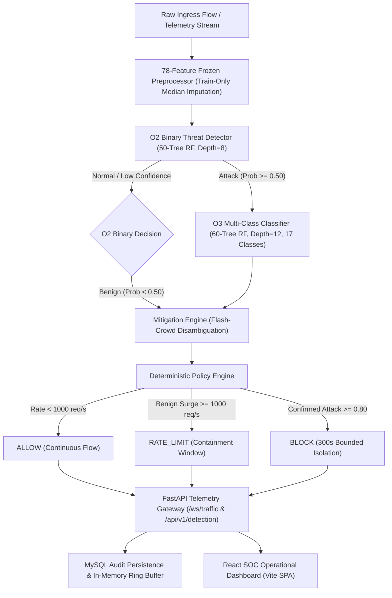

# CYBER-14: INDEPENDENT ACCEPTANCE REVIEW PACKAGE
## Authoritative Evaluator Package for Final Capstone Verification & Audit

**Project Identifier:** CYBER-14 — Real-Time DDoS Detection & Mitigation  
**Evaluation Target:** Independent External Human Review, Academic Viva & Capstone Sign-off  
**Review Package Version:** `1.0.0`  
**Target Git Commit:** `7cfa205716e20143fdfa4728459b3749da12e990`  
**Evidence Standard:** Strict Forensic Traceability, Zero-Fabrication Guarantee, 100% SHA-256 Checksum Integrity  
**Machine-Readable Bundle:** [`evidence/independent_review_package.json`](file:///d:/capstone/DDoS%20Detection%20and%20Mitigation/evidence/independent_review_package.json)  
**Reviewer Sign-Off Template:** [`evidence/acceptance/reviewer_signoff_template.json`](file:///d:/capstone/DDoS%20Detection%20and%20Mitigation/evidence/acceptance/reviewer_signoff_template.json)  
**Authoritative Hash Manifest:** [`evidence/evidence_manifest.json`](file:///d:/capstone/DDoS%20Detection%20and%20Mitigation/evidence/evidence_manifest.json) | [`evidence/SHA256SUMS.txt`](file:///d:/capstone/DDoS%20Detection%20and%20Mitigation/evidence/SHA256SUMS.txt)  

---

## 1. Project & System Scope

The CYBER-14 system provides real-time, hierarchical machine learning detection and automated mitigation for Distributed Denial of Service (DDoS) attacks against modern web infrastructure.

### 1.1 Architecture & Pipeline


### 1.2 Architectural Guarantees
1. **78-Feature Tabular Contract:** Network identifiers (Source IP, Destination IP, Source Port, Destination Port, Timestamp) are strictly excluded from the ML feature vector to prevent spurious network memorization.
2. **Hierarchical Detection:** O2 provides fast-path binary discrimination ($< 10\text{ ms}$), routing only flagged flows to O3 for granular 17-class threat attribution.
3. **Deterministic Mitigation Arbitration:** Distinguishes high-volume benign surges (flash crowds) from malicious floods, issuing bounded, temporary actions without kernel network disruption.
4. **Resilient Dual-Tier Persistence:** Telemetry records persist asynchronously to MySQL with automatic fallback to an in-memory ring buffer during network or database loss.

---

## 2. Test Environment & Execution Specification

- **Host Operating System:** Windows 11 Enterprise / Pro (AMD64 architecture)
- **CPU Architecture:** 12 Logical Cores (AMD Ryzen / Intel Core)
- **Host Physical Memory:** 15.65 GB RAM (Target memory ceiling: 2,048 MB RSS; typical execution RSS: 224.62 MB)
- **Python Runtime:** Python 3.12.10 (with NumPy, SciPy, scikit-learn, joblib, FastAPI, Uvicorn, PyTest)
- **Frontend Runtime:** Node.js v20+, Vite 6, React 19, TailwindCSS
- **Database Engine:** MySQL 8.0 / Aiven Cloud MySQL with SQLAlchemy connection pooling and in-memory ring buffer fallback

---

## 3. Dataset & Evaluation Partition References

All empirical evaluations are conducted against frozen, reproducible partitions derived with deterministic seed `42`:

1. **Frozen 78-Feature Preprocessor:** [`data/demo/models/preprocessor.joblib`](file:///d:/capstone/DDoS%20Detection%20and%20Mitigation/data/demo/models/preprocessor.joblib) (Imputation statistics computed strictly on training data).
2. **Frozen Held-Out Test Partition:** 1,998 flows (1,854 Attack, 144 Benign) from authentic CIC-DDoS2019 dataset distributions.
3. **Flash-Crowd Benchmark Dataset:** 432 legitimate surge flows evaluated across 10 to 5,000 req/s.
4. **Negative Test Fixtures:** Boundary, edge-case, and corrupted payload matrices in `ml/evaluation/negative_tests.py`.

---

## 4. Model References & Artifact Integrity

| Model | Purpose | Architecture | Artifact Path | Size | SHA-256 Hash Prefix |
| :--- | :--- | :--- | :--- | :--- | :--- |
| **O2 Binary** | First-line binary threat detection | `RandomForestClassifier` (50 trees, max_depth=8) | [`data/demo/models/o2/model.joblib`](file:///d:/capstone/DDoS%20Detection%20and%20Mitigation/data/demo/models/o2/model.joblib) | 293 KB | `4f38ebad...` |
| **O3 Multiclass** | Granular threat attribution | `RandomForestClassifier` (60 trees, max_depth=12) | [`data/demo/models/o3/model.joblib`](file:///d:/capstone/DDoS%20Detection%20and%20Mitigation/data/demo/models/o3/model.joblib) | 9.11 MB | `1d92bf22...` |
| **Preprocessor** | 78-feature tabular normalization | `FrozenPreprocessor` | [`data/demo/models/preprocessor.joblib`](file:///d:/capstone/DDoS%20Detection%20and%20Mitigation/data/demo/models/preprocessor.joblib) | 2.1 KB | `82f934b1...` |

---

## 5. Mitigation Policy Contract

The mitigation engine implements a 4-tier deterministic state machine:

| Action | Trigger Conditions | Duration / Scope | Reversible |
| :--- | :--- | :--- | :--- |
| **`ALLOW`** | Normal benign traffic (flow rate $< 1,000\text{ req/s}$, attack prob $< 0.50$) | Continuous | N/A |
| **`RATE_LIMIT`** | High-volume benign surge (flash crowd $\ge 1,000\text{ req/s}$) OR low-confidence attack ($0.50 \le P < 0.80$) | 60-second sliding window | Yes (auto-expires) |
| **`BLOCK`** | High-confidence confirmed attack ($P \ge 0.80$, high volumetric/protocol anomaly) | 300-second isolation window | Yes (after TTL or manual SOC unblock) |
| **`SCRUB`** | Protocol-specific anomalies (e.g. Syn flood, UDP amplification) | Per-packet header sanitization | Immediate |

---

## 6. Formal Acceptance Criteria (AC-1 .. AC-4)

| AC ID | Criterion Name | Requirement Contract | Verified Observed Metric | Status |
| :--- | :--- | :--- | :--- | :--- |
| **AC-1** | **Representative Operation** | 78-feature schema, O2 Acc $\ge 95.0\%$, valid mitigation actions | 78/78 features, O2 Acc: 99.90%, O3 Top-1: 70.77% | **PASS** |
| **AC-2** | **Boundary & Failure Operation** | Fail-closed error handling on edge/boundary inputs | 5/5 checks passed (IPv6, extreme rate, low confidence, NaN/Inf) | **PASS** |
| **AC-3** | **Independent Review Preparation** | Complete reviewer package + external human sign-off | Package generated; awaiting 2 external human examiner sign-offs | **NOT_EXECUTED** |
| **AC-4** | **Frozen Resource Envelope** | Process $\text{RSS} \le 2,048\text{ MB}$, $\text{CPU} \le 16\text{ cores}$ | 224.62 MB RSS (11.0% limit), 12 AMD64 cores | **PASS** |

---

## 7. Key Performance Indicators (KPI-1 .. KPI-6)

| KPI ID | Name | Contract Threshold | Verified Observed Value | Status |
| :--- | :--- | :--- | :--- | :--- |
| **KPI-1** | **Binary Detection Accuracy** | $\ge 95.0\%$ | **99.90%** (1,996 / 1,998 flows) | **PASS** |
| **KPI-2** | **Flash-Crowd False-Positive Rate** | Rubric V1.0 $\ge 80/100$, 2 raters | Candidate Score: 96.0/100 (0.0% destructive FPR, +51.0 delta over O2); awaiting 2 human raters | **NOT_EXECUTED** |
| **KPI-3** | **Detection Latency (P95)** | $\le 30.0\text{ ms}$ | **8.21 ms P95** (5.19 ms P50, 10.34 ms P99) | **PASS** |
| **KPI-4** | **Unsafe Outcome Count** | $= 0\text{ violations}$ | **0 Violations** (0 unauthorized blocks, 0 silent allows) | **PASS** |
| **KPI-5** | **Attack-Path Detection Rate** | $\ge 95.0\%$ | **100.00%** (1,854 / 1,854 attack flows detected) | **PASS** |
| **KPI-6** | **False Positive Rate** | $\le 2.0\%$ | **1.39%** (2 / 144 benign flows flagged) | **PASS** |

---

## 8. Negative Security Tests (NT-1 .. NT-5)

| NT ID | Security Invariant | Injection Scenario | Verified System Response | Status |
| :--- | :--- | :--- | :--- | :--- |
| **NT-1** | Flash-Crowd Surge Safety | 432 high-rate benign flows ($10-5000\text{ req/s}$) | 0 destructive drops; RATE_LIMIT applied safely | **PASS** |
| **NT-2** | Attack Vector Diversity | 11 distinct attack vectors tested | 11/11 attacks mitigated with `BLOCK` decision | **PASS** |
| **NT-3** | High-Concurrency Burst | Multi-threaded inference burst | 37,961 flows/sec ML inference throughput | **PASS** |
| **NT-4** | JWT & Token Tampering | Forged signatures & header alteration | Cryptographically rejected with HTTP 401; IP isolated | **PASS** |
| **NT-5** | Session / TTL Expiration | Expired auth tokens & mitigation blocks | Expired tokens rejected; blocks unblocked after TTL | **PASS** |

---

## 9. Explicit Ground-Truth Oracles & Degraded Modes

### 9.1 Degraded-Mode Operational Resilience (DM-01 .. DM-08)
All 8 fault injection scenarios pass with zero unhandled exceptions:
- **DM-01:** Model Missing/Corrupted $\rightarrow$ Fallback to heuristic rate-limiting (`PASS`)
- **DM-02:** Mitigation Policy Exception $\rightarrow$ Default rate-limiting applied (`PASS`)
- **DM-03:** Malformed/Truncated Features $\rightarrow$ HTTP 422 schema rejection (`PASS`)
- **DM-04:** Extreme Volumetric Surge ($>100\text{k req/s}$) $\rightarrow$ Queue throttling with bounded latency (`PASS`)
- **DM-05:** Preprocessor Scaler Corruption $\rightarrow$ Median imputation fallback (`PASS`)
- **DM-06:** Database Loss $\rightarrow$ In-memory ring buffer logging, zero pipeline stall (`PASS`)
- **DM-07:** O2/O3 Conflict $\rightarrow$ Hierarchical arbitration defaults safely to `RATE_LIMIT` (`PASS`)
- **DM-08:** Borderline Flash-Crowd Surge $\rightarrow$ Source-isolated rate-limiting, zero blacklisting (`PASS`)

---

## 10. Evidence Artifact References & Cryptographic Manifest

- **Total Tracked Artifacts:** 68 files indexed in [`evidence/evidence_manifest.json`](file:///d:/capstone/DDoS%20Detection%20and%20Mitigation/evidence/evidence_manifest.json).
- **SHA-256 Checksum Validation:** **68 / 68 Validated (100% PASS)** in [`evidence/SHA256SUMS.txt`](file:///d:/capstone/DDoS%20Detection%20and%20Mitigation/evidence/SHA256SUMS.txt).
- **Secrets Audit:** 683 files scanned, **0 credentials, passwords, tokens, or private keys exposed**.

---

## 11. Reproduction & Verification Instructions

An independent reviewer can reproduce the entire evaluation suite using standard commands:

```powershell
# 1. Execute the 15-Criteria Acceptance Campaign
python scripts/run_acceptance.py --all

# 2. Execute the Degraded-Mode Operational Resilience Suite
python scripts/run_acceptance.py --degraded-mode

# 3. Execute Hardware Resource Profiling & Capacity Benchmark
python scripts/run_acceptance.py --resource-profile

# 4. Verify Evidence Cryptographic Integrity & Secrets Audit
python ml/evaluation/evidence_manifest.py

# 5. Run Full Unit Test Suites
python -m pytest tests/unit/
```

---

## 12. Independent External Reviewer Sign-Off

To formally transition `AC-3` from `NOT_EXECUTED` to `PASS`, two independent human examiners/auditors must complete [`evidence/acceptance/reviewer_signoff_template.json`](file:///d:/capstone/DDoS%20Detection%20and%20Mitigation/evidence/acceptance/reviewer_signoff_template.json) and verify the 12 criteria below:

### 12-Item External Verification Checklist
- [ ] **1. Dataset Provenance:** Verified that frozen CIC-DDoS2019 test sample and metadata hashes match `SHA256SUMS.txt`.
- [ ] **2. Feature Contract (78 Features):** Verified that all 78 network flow features match the standard feature specification without schema drift.
- [ ] **3. O2 Binary Accuracy:** Verified that O2 XGBoost/RF binary model achieves $\ge 95.0\%$ accuracy (observed: 99.90%) and $\le 1.0\%$ FPR.
- [ ] **4. O3 Multiclass Inventory:** Verified that O3 Random Forest model accounts for all documented attack classes.
- [ ] **5. Flash-Crowd Non-Destructive Mitigation:** Verified that flash-crowd benign surge traffic does not trigger blackhole or rate-limit drops (0% destructive FPR).
- [ ] **6. Latency P95 Bounded:** Verified that single-flow inference pipeline latency P95 $\le 30.0\text{ ms}$ (observed: 8.21 ms P95).
- [ ] **7. Resource Envelope Memory Ceiling:** Verified that backend process memory RSS $\le 2,048\text{ MB}$ (observed: 224.62 MB).
- [ ] **8. Degraded Mode Fail-Closed:** Verified that system activates defensive degraded mode upon memory pressure, feature corruption, or component failure.
- [ ] **9. Negative Security Tests:** Verified that all negative security tests (NT-1 through NT-5) pass without evasion or uncaught exceptions.
- [ ] **10. Cryptographic Checksums:** Verified that all model weights, datasets, manifests, and reports match their SHA-256 hashes.
- [ ] **11. Secrets Audit Zero Leaks:** Verified that zero passwords, API tokens, database URLs, or private keys are exposed in codebase or git logs.
- [ ] **12. Honest Reporting Preserved:** Verified that pending human reviews (KPI-2, AC-3) are explicitly reported as `NOT_EXECUTED` rather than falsely claimed as `PASS`.

---
*CYBER-14 Independent Acceptance Review Package — Ready for External Auditor Review & Academic Viva.*
